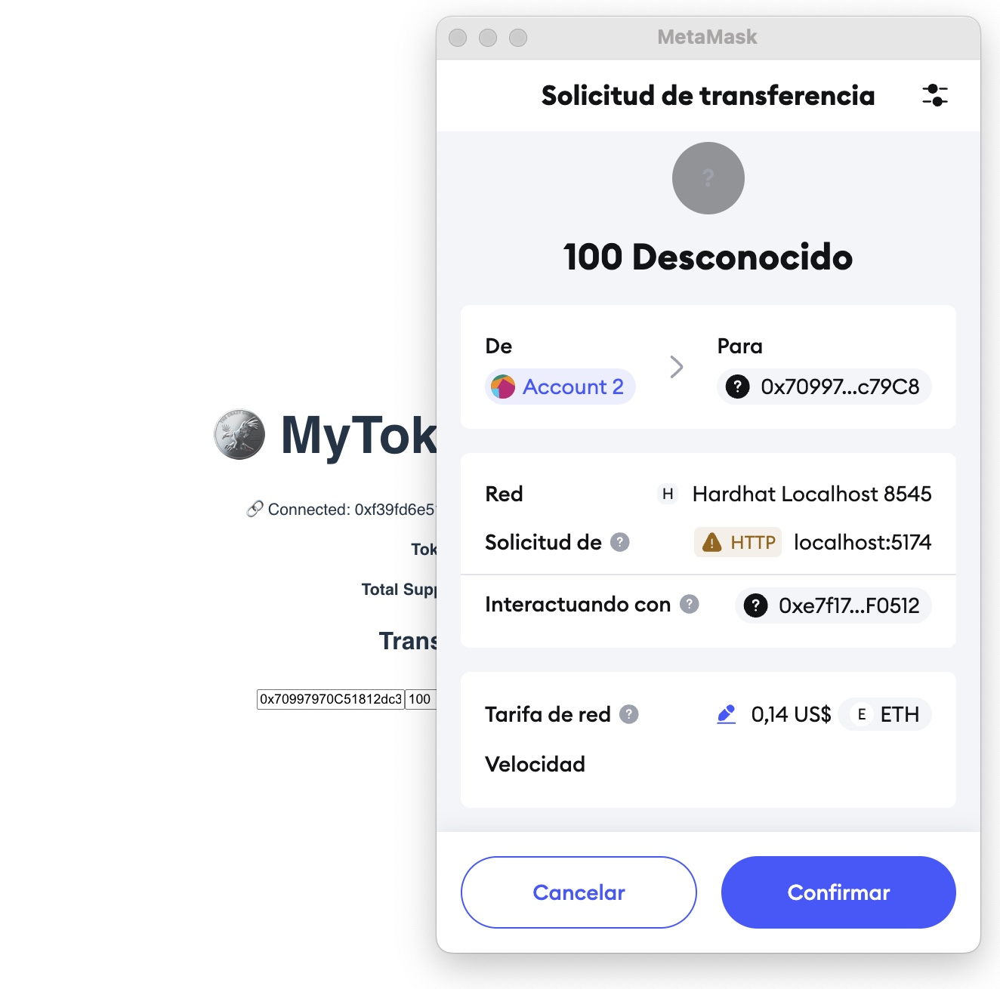
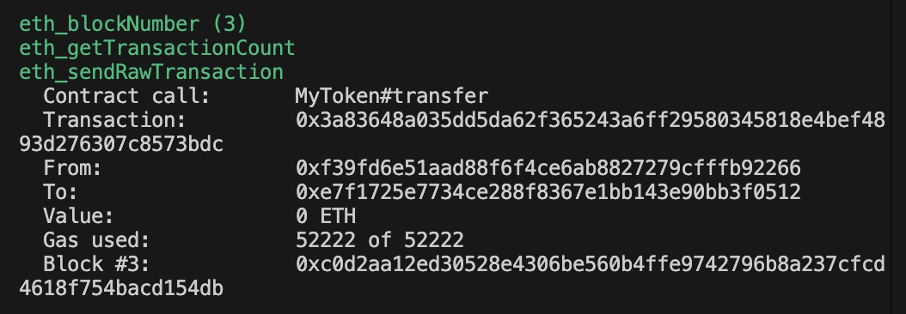

# AI for Blockchain – ERC-20 Token Interface

This project uses Generative AI tools for smart contract development and interaction.

## Objective

- Deploy an ERC-20 smart contract using Solidity
- Build a JavaScript front-end to interact with it
- Use tools like Hardhat and MetaMask to test it on a local blockchain

## Tech Stack

- Solidity – ERC-20 contract
- Hardhat – Development framework and local blockchain
- React + Vite – Front-end interface
- Ethers.js – Blockchain interaction
- MetaMask – Wallet connection

## How to Run

### 1. Clone the project

```bash
git clone https://github.com/smorenolasa1/ai-for-blockchain.git
cd ai-for-blockchain
```

### 2. Install dependencies

```bash
cd smart-contract
npm install
```

### 3. Start the local Hardhat node

```bash
npx hardhat node
```

This will start a local blockchain at `http://127.0.0.1:8545` and create test accounts with 10,000 ETH each.

### 4. Deploy the smart contract

In another terminal:

```bash
npx hardhat run scripts/deploy.js --network localhost
```

Copy the deployed contract address and update it in `frontend/my-token-interface/src/App.jsx`:

```js
const contractAddress = "0x..."; // your deployed address here
```

### 5. Import a test account in MetaMask

1. Open MetaMask → "Import Account"
2. Use the private key of the first Hardhat test account:

```
0xac0974bec39a17e36ba4a6b4d238ff944bacb478cbed5efcae784d7bf4f2ff80
```

3. Connect MetaMask to a Custom Network:

| Field            | Value                   |
|------------------|-------------------------|
| Network Name     | Hardhat Localhost 8545  |
| RPC URL          | http://127.0.0.1:8545   |
| Chain ID         | 31337                   |
| Currency Symbol  | ETH                     |

### 6. Run the React Frontend

```bash
cd frontend/my-token-interface
npm install
npm run dev
```

Then open [http://localhost:5173](http://localhost:5173) in your browser.

## Features

- Wallet connection with MetaMask
- Token name and total supply displayed
- User balance shown in real time
- Transfer tokens to other addresses

## GenAI Contribution

This project was built with the support of ChatGPT 4, which assisted in:

- Writing the initial ERC-20 smart contract
- Setting up Hardhat and deployment scripts
- Debugging MetaMask and network configuration
- Generating frontend code with ethers.js integration
- Providing guidance on interpreting logs and errors

## Project Structure

```
ai-for-blockchain/
├── smart-contract/
│   ├── contracts/MyToken.sol
│   ├── scripts/deploy.js
│   └── hardhat.config.js
└── frontend/
    └── my-token-interface/
        ├── src/App.jsx
        └── package.json
```

## App Walkthrough

This section provides a step-by-step walkthrough of the application interface and how a token transfer works.


1. **Connecting the Wallet**  
   The user is prompted to connect their MetaMask wallet to the MyToken interface.  
   

2. **Wallet Connected**  
   The wallet is successfully connected. Token name and total supply are displayed.  
   

3. **Filling Transfer Details**  
   The user enters the recipient address and the number of tokens to send.  
   

4. **MetaMask Transfer Request**  
   MetaMask shows the transaction request for approval before sending tokens.  
   

5. **Smart Contract Logs**  
   The Hardhat terminal shows logs of the transaction, including sender, recipient, and gas usage.  
   

6. **Successful Transfer Message**  
   A confirmation message appears in the browser indicating the tokens were successfully sent.  
   

7. **Post-Transfer State**  
   The user's token balance is updated after the transfer.  
   
